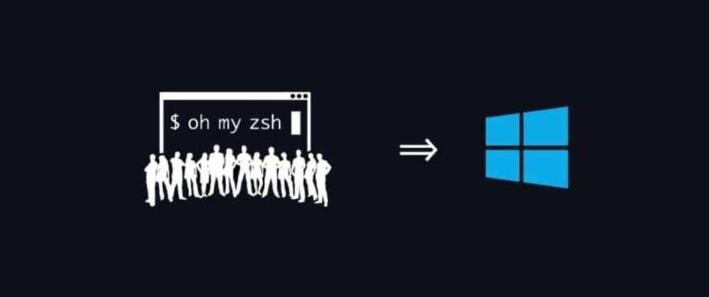

<p align="center">
  <a href="" rel="noopener">
 </a>
</p>

<h3 align="center">Windows Terminal Ohmyzsh</h3>

<div align="center">

[]()
[](https://github.com/kylelobo/The-Documentation-Compendium/issues)
[](https://github.com/kylelobo/The-Documentation-Compendium/pulls)
[](/LICENSE)

</div>

---

<p align="center"> Arquivos e Tutorial de como usar o OhMyZsh no Windows.
    <br> 
</p>

## 📝 Sumário

- [Sobre](#about)
- [Getting Started](#getting_started)
- [Pré-requisito](#pre_requisitos)]
- [Personalização do Terminal](#personalizacao)
- [Configuração Ubuntu](#configUbuntu)
- [Instalando o OhMyZsh](#installZsh)
- [Configuração do Spaceship](#configSpace)
- [Plugins do OhMyZsh](#plugins)
- [Authors](#authors)

## 🧐 Sobre <a name = "about"></a>

Como instalar e usar OhMyZsh no Windows Terminal

## 🏁 Getting Started <a name = "getting_started"></a>

Antes de tudo, instale o pacote de fontes Fira Code.

Você precisará verificar se tem os componentes opcionais do Subsistema do Windows para Linux e da Plataforma de Máquina Virtual instalados. Você pode fazer isso executando o seguinte comando no PowerShell como Administrador:

````
dism.exe /online /enable-feature /featurename:Microsoft-Windows-Subsystem-Linux /all /norestart
````
````
dism.exe /online /enable-feature /featurename:VirtualMachinePlatform /all /norestart
````

### Pré-requisito <a name = "pre_requisitos"></a>

Instalar Windows Terminal Preview na [Microsoft Store](https://www.microsoft.com/pt-br/p/windows-terminal-preview/9n0dx20hk701?activetab=pivot:overviewtab)

Instalar Ubuntu 20.04 LTS na [Microsoft Store](https://www.microsoft.com/pt-br/p/ubuntu/9nblggh4msv6?activetab=pivot:overviewtab)


### Personalizando o Windows Terminal <a name = "personalizacao"></a>

Acesse o diretório abaixo com o comando Windows + R: 

````
C:\Users\{your_user}\AppData\Local\Packages\Microsoft.WindowsTerminal_8wekyb3d8bbwe\LocalState
````

Substitua o arquivo settings.json do diretório pelo deste repositório.

Agora copie a pasta SysIcon para a raiz C:.

### Configurando o Ubuntu <a name="configUbuntu"></a>

Acesse o Windows Terminal e selecione o Terminal do Ubuntu caso não venha como padrão.

````
cd ~
````

Faça o fetch das atualizações: 

````
sudo apt-get update
````

Agora, atualize seu Ubuntu:
````
sudo apt-get upgrade
````

Atualize o Git adicionando uma ppa: 
````
sudo add-apt-repository ppa:git-core/ppa
````

E por fim atualize novamente e instale o restando do git:
````
sudo apt update; sudo apt install git
````

### Instalando o oh-my-zsh <a name="installZsh"></a>

Com o Windows Terminal aberto no Ubuntu, execute o comando
````
sudo apt-get install zsh
````

Agora, instale a extensão [Remote - Wsl](https://marketplace.visualstudio.com/items?itemName=ms-vscode-remote.remote-wsl) no seu VS Code.

No Windows Terminal, digite o seguinte comando pra abrir o arquivo do bash no VSCode:
````
code ~/.bashrc
````

Dentro do arquivo, adicione na primeira linha o script a seguir:
````
# if running in terminal...
if test -t 1; then
# ...start zsh
exec zsh
fi
````
Obs: Tem que ser na primeira linha, mesmo. Se fizer no final do arquivo, pode conflitar com outra condição.

No terminal do Ubuntu, execute o seguinte comando para instalar o oh-my-zsh:
````
sh -c "$(curl -fsSL https://raw.githubusercontent.com/robbyrussell/oh-my-zsh/master/tools/install.sh)"
````

Agora, vamos instalar o tema Spaceship, execute o comando ````cd ~```` e depois´
````
git clone https://github.com/denysdovhan/spaceship-prompt.git "$ZSH_CUSTOM/themes/spaceship-prompt"
````

No Windows Terminal execute o comando
````
ln -s "$ZSH_CUSTOM/themes/spaceship-prompt/spaceship.zsh-theme" "$ZSH_CUSTOM/themes/spaceship.zsh-theme"
````
Feito isso execute code ~/.zshrc e no campo ZSH_THEME="robbyrussell" você insere o nome do tema que quer usar, no caso vamos deixar como ZSH_THEME="spaceship"

### Configurando o Spaceship <a bane="configSpace"></a>

Execute code ~/.zshrc e adicione o seguinte conteúdo:
````
SPACESHIP_PROMPT_ORDER=(
  user          # Username section
  dir           # Current directory section
  host          # Hostname section
  git           # Git section (git_branch + git_status)
  hg            # Mercurial section (hg_branch  + hg_status)
  exec_time     # Execution time
  line_sep      # Line break
  vi_mode       # Vi-mode indicator
  jobs          # Background jobs indicator
  exit_code     # Exit code section
  char          # Prompt character
)
SPACESHIP_USER_SHOW=always
SPACESHIP_PROMPT_ADD_NEWLINE=false
SPACESHIP_CHAR_SYMBOL="->"
SPACESHIP_CHAR_SUFFIX=" "
````

### Plugins do ZSH <a name="plugins"></a>

Execute o comando
````
sh -c "$(curl -fsSL https://raw.githubusercontent.com/zdharma/zinit/master/doc/install.sh)"
`````

Após essa instalação, vamos abrir o arquivo ~/.zshrc novamente executando code ~/.zshrc e abaixo da linha ### End of ZInit's installer chunk que foi adicionada automaticamente no arquivo, adicionamos o seguinte código:
````
zinit light zdharma/fast-syntax-highlighting
zinit light zsh-users/zsh-autosuggestions
zinit light zsh-users/zsh-completions
`````

## 🎈 Usage <a name="usage"></a>

Pronto, já temos um ambiente configurado com ferramentas nativas e com Zsh como shell padrão do Terminal Linux, tudo isso gerenciado dentro do Windows Terminal.

## ✍️ Authors <a name = "authors"></a>

- [@hicolazu](https://github.com/hicolazu) - Fork and Update work
- [@erickrock](https://github.com/ErickRock) - Initial Work 
- [dev.to](https://dev.to/erickrock80/pt-br-instalando-oh-my-zsh-no-windows-terminal-3a8l) - Article by @ericrock